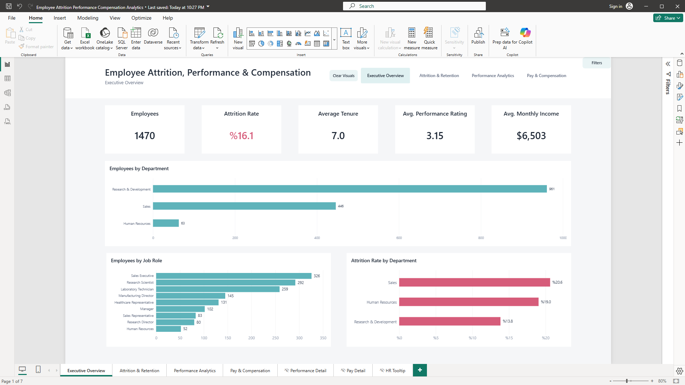
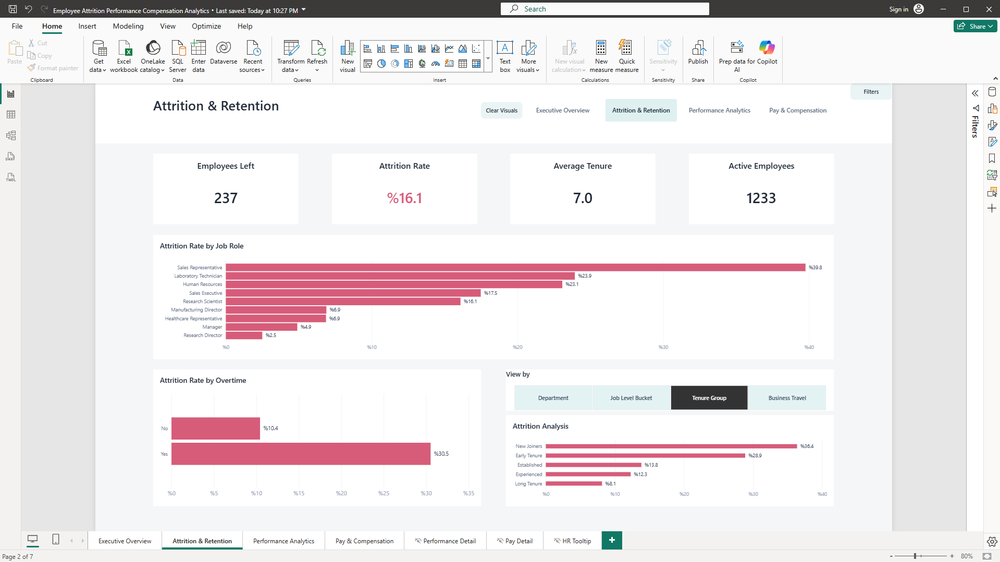
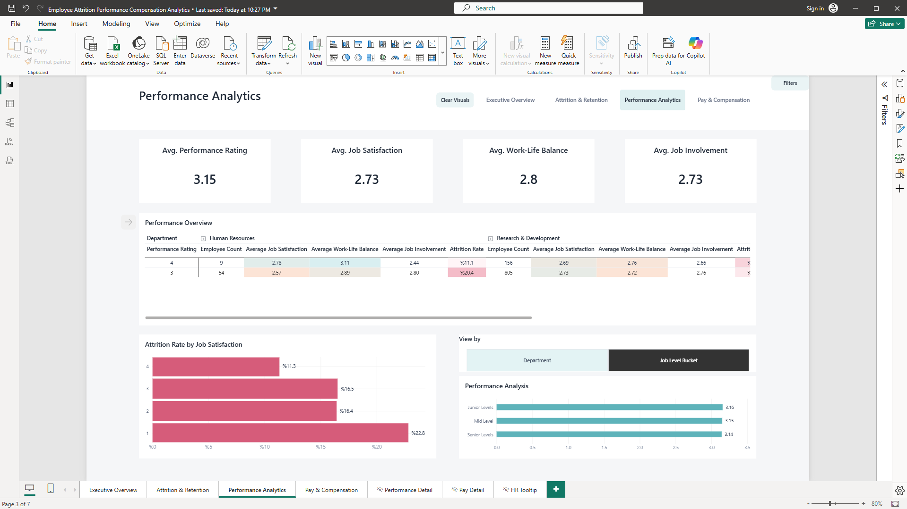
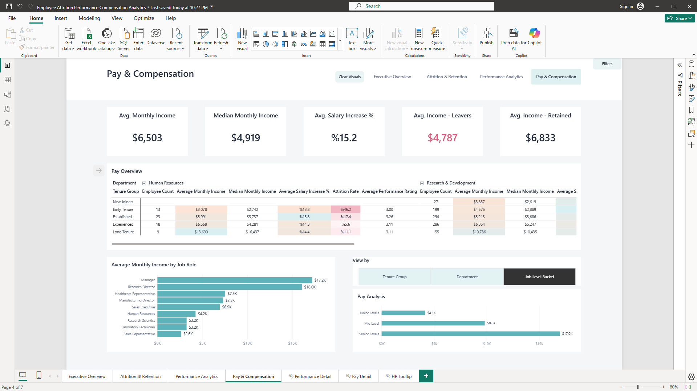
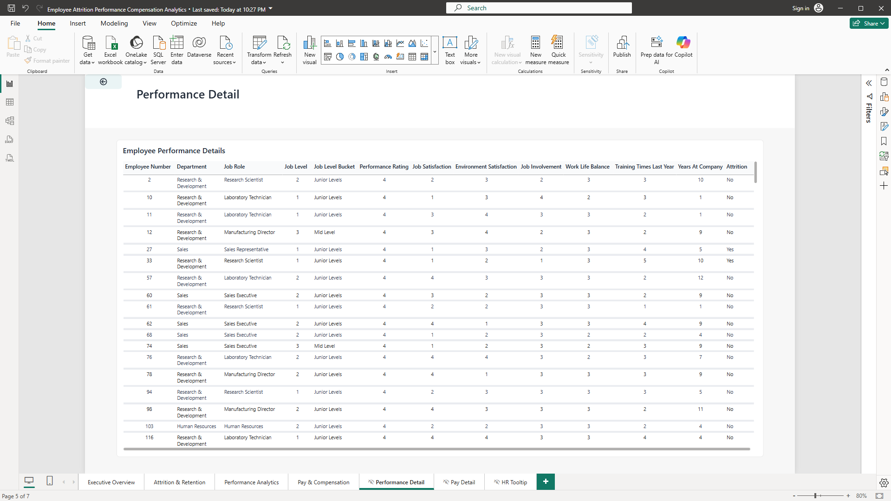
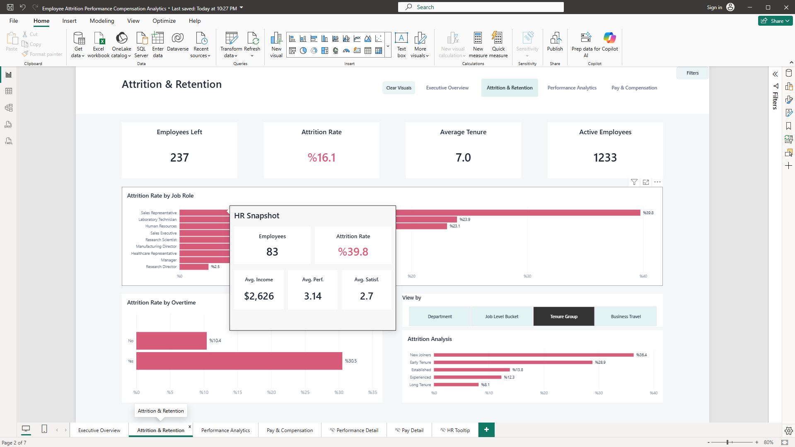

# Employee Attrition, Performance & Compensation Analytics

**Created by Yusufcan Gumus**

## Project Overview

This Power BI project analyzes employee attrition, workforce performance, employee experience, and compensation using the IBM HR Analytics Employee Attrition sample dataset.

The report was developed as an HR / People Analytics portfolio project with a focus on creating an interactive, business-facing analytical experience rather than presenting only static visualizations.

The project demonstrates an end-to-end Power BI workflow including:

- Data preparation in Power Query
- DAX measures
- Calculated analytical fields
- Field parameters
- Matrix hierarchies
- Conditional formatting
- Drill-through analysis
- Custom report-page tooltips
- Bookmark-based filter panels
- Synchronized report-wide slicers
- Page-level visual selection clearing
- Cross-filtering
- Navigation and report UX design

---

# Business Questions

The report was designed to answer practical HR / People Analytics questions such as:

- What is the overall employee attrition rate?
- How many employees have left and how many remain active?
- Which departments experience the highest attrition?
- Which job roles experience the highest attrition?
- Is attrition higher among employees who work overtime?
- How does attrition vary across tenure groups?
- How does attrition vary across job levels?
- Does business travel appear to be associated with different attrition patterns?
- Which workforce segments show lower job satisfaction?
- How does job satisfaction relate to attrition patterns?
- How does employee performance vary across departments and job levels?
- How do job involvement and work-life balance vary across workforce segments?
- How does compensation differ across job roles?
- How does compensation differ across departments?
- How does compensation differ across tenure groups?
- How does compensation differ across job levels?
- What is the difference between average and median monthly income?
- Is average income different between employees who left and employees who remained?
- Which employee groups may require closer attention from an HR retention perspective?
- How can high-level workforce trends be explored further using drill-through and employee-level detail?

---

# Project Workflow

The project followed an end-to-end Power BI analytics workflow.

## 1. Understand the Dataset

- Review employee, attrition, performance, satisfaction, tenure, and compensation variables
- Identify the most relevant HR business questions
- Determine which variables are suitable for segmentation and comparison

## 2. Prepare the Data in Power Query

- Remove unnecessary fields
- Validate data types
- Standardize category labels
- Improve business readability
- Prepare fields for reporting

## 3. Create Analytical Fields

- Build calculated grouping fields
- Create reusable DAX measures
- Organize measures into logical folders
- Prepare dynamic analysis dimensions

## 4. Design the Report Structure

The report was divided into:

- Executive Overview
- Attrition & Retention
- Performance Analytics
- Pay & Compensation
- Performance Detail
- Pay Detail
- HR Snapshot Tooltip

## 5. Build Interactive Analysis

Interactive functionality includes:

- Field parameters
- Synchronized slicers
- Bookmark-controlled filter panels
- Clear Visuals controls
- Drill-through
- Custom report-page tooltips
- Cross-filtering

## 6. Apply Report Formatting and UX

- Consistent navigation
- Business-friendly labels
- Consistent color usage
- Conditional formatting
- Context-specific tooltips
- Dedicated drill-through controls

## 7. Validate the Report

The final report was tested to verify:

- Synchronized filters across pages
- Filter panel opening and closing
- Clear Visuals behavior
- Drill-through functionality
- Back navigation
- Tooltip context
- Field parameter switching
- Visual interactions

---

# Analysis Approach

The analysis was structured around four connected HR perspectives.

## Workforce Overview

Understand the size and composition of the workforce before examining more specific HR outcomes.

## Attrition & Retention

Identify workforce segments with comparatively high attrition and explore patterns related to:

- Job Role
- Overtime
- Department
- Tenure
- Job Level
- Business Travel

## Performance & Employee Experience

Compare:

- Performance Rating
- Job Satisfaction
- Environment Satisfaction
- Job Involvement
- Work-Life Balance

across workforce segments.

## Compensation

Analyze compensation differences across:

- Job Roles
- Departments
- Tenure Groups
- Job Levels
- Attrition Status

The analysis is descriptive.

Relationships identified in the dashboard should not be interpreted as evidence that one factor causes another.

---

# Dashboard Pages

## Executive Overview

The Executive Overview provides a high-level summary of the workforce.

Key metrics include:

- Employee Count
- Attrition Rate
- Average Tenure
- Average Performance Rating
- Average Monthly Income

Supporting visuals show:

- Employees by Department
- Employees by Job Role
- Attrition Rate by Department

The page also provides access to synchronized report-wide filters.



---

## Attrition & Retention

The Attrition & Retention page focuses on employee turnover patterns.

Key metrics include:

- Employees Left
- Attrition Rate
- Average Tenure
- Active Employees

Attrition is analyzed by:

- Job Role
- Overtime
- Department
- Job Level
- Tenure Group
- Business Travel

A field parameter allows users to dynamically change the dimension displayed in the Attrition Analysis visual.



---

## Performance Analytics

The Performance Analytics page examines employee performance and workplace experience.

Key metrics include:

- Average Performance Rating
- Average Job Satisfaction
- Average Work-Life Balance
- Average Job Involvement

The Performance Overview matrix supports hierarchical analysis across:

- Department
- Job Level Bucket
- Performance Rating

Additional analysis includes:

- Attrition Rate by Job Satisfaction
- Dynamic Performance Analysis

Conditional formatting is used to make differences between workforce segments easier to identify.

The page also includes an employee-level drill-through path.



---

## Pay & Compensation

The Pay & Compensation page examines compensation patterns across the workforce.

Key metrics include:

- Average Monthly Income
- Median Monthly Income
- Average Salary Increase %
- Average Income - Leavers
- Average Income - Retained

Compensation is analyzed across:

- Job Role
- Tenure Group
- Department
- Job Level Bucket

The Pay Overview matrix combines compensation, performance, workforce size, and attrition information.



---

# How to Use the Report

## Universal Filters

Each of the four main report pages contains a **Filters** button.

Clicking the Filters button opens a filter panel containing:

- Department
- Job Role
- Job Level
- Overtime

These slicers are synchronized across the four main report pages.

This means a filter selected on one page remains active when navigating to another page.

### Example

1. Open the Filters panel
2. Select `Department = Human Resources`
3. Navigate to another main report page
4. The Human Resources filter remains active
5. Open the Filters panel on the new page
6. Human Resources is still selected

The synchronized filter system applies across:

- Executive Overview
- Attrition & Retention
- Performance Analytics
- Pay & Compensation

Use the **×** button inside the filter panel to close it.

Opening or closing the filter panel does not change the selected filter values.

---

## Reset Filters

The Executive Overview filter panel includes a **Reset Filters** button.

This restores the synchronized report-wide slicers to their default state.

Because the slicers are synchronized, resetting the filters also resets their selections across the other main report pages.

---

## Clear Visuals

Each main report page includes a **Clear Visuals** button.

This button removes temporary selections caused by clicking data inside charts, matrices, or other interactive visuals.

For example, clicking a chart bar may cause other visuals on the page to become cross-filtered or highlighted.

Clicking **Clear Visuals** restores those visual selections to their normal state.

### Important

**Clear Visuals does not remove the synchronized universal filters.**

For example:

1. Set `Department = Human Resources` using the Filters panel
2. Click a bar in a chart
3. Other visuals react to the selected bar
4. Click **Clear Visuals**
5. The temporary chart selection is removed
6. `Department = Human Resources` remains active

This keeps report-wide filtering separate from temporary visual interactions.

---

## Field Parameter Controls

Several report pages contain a **View by** control.

Power BI field parameters allow the user to dynamically change the analytical dimension displayed in a visual without requiring multiple separate charts.

### Attrition Analysis

Users can switch between:

- Department
- Job Level Bucket
- Tenure Group
- Business Travel

### Performance Analysis

Users can switch between:

- Department
- Job Level Bucket

### Pay Analysis

Users can switch between:

- Tenure Group
- Department
- Job Level Bucket

This provides several analytical perspectives while keeping the report compact.

---

## Drill-Through Analysis

The Performance Analytics and Pay & Compensation pages include dedicated drill-through arrow buttons.

These allow the user to move from aggregated analysis to employee-level detail.

### Performance Drill-Through

To use the Performance drill-through:

1. Select a performance segment in the Performance Overview matrix
2. Click the arrow button next to the matrix
3. Power BI opens the Performance Detail page
4. The employee table is automatically filtered to the selected context

When the drill-through button is available, its tooltip displays:

`View employee-level performance details`

When a valid segment has not been selected, the tooltip displays:

`Select a performance segment in the matrix, then click to view employee-level performance details`

The Performance Detail table includes:

- Employee Number
- Department
- Job Role
- Job Level
- Job Level Bucket
- Performance Rating
- Job Satisfaction
- Environment Satisfaction
- Job Involvement
- Work-Life Balance
- Training Times Last Year
- Years at Company
- Attrition



---

### Pay Drill-Through

To use the Pay drill-through:

1. Select a pay segment in the Pay Overview matrix
2. Click the arrow button next to the matrix
3. Power BI opens the Pay Detail page
4. The employee table is filtered to the selected context

When enabled, the tooltip displays:

`View employee-level compensation details`

When a valid segment has not been selected, the tooltip displays:

`Select a pay segment in the matrix, then click to view employee-level compensation details`

The Pay Detail table includes:

- Employee Number
- Department
- Job Role
- Job Level
- Job Level Bucket
- Years at Company
- Tenure Group
- Monthly Income
- Salary Increase %
- Stock Option Level
- Performance Rating
- Attrition

Both drill-through pages include a back button that returns the user to the previous report page.

---

## HR Snapshot Tooltip

Selected report visuals use a custom report-page tooltip called **HR Snapshot**.

To use the tooltip:

1. Hover over a supported chart bar or data point
2. Wait for the tooltip to appear
3. Power BI calculates additional HR metrics for that specific context

The HR Snapshot displays:

- Employee Count
- Attrition Rate
- Average Income
- Average Performance Rating
- Average Job Satisfaction

For example, hovering over a Job Role displays HR metrics calculated only for employees belonging to that role.

This provides additional information without permanently adding more visuals to the report page.



---

# Data Preparation

Power Query was used to clean and prepare the dataset before analysis.

Data preparation included:

- Removing unnecessary constant columns
- Renaming fields for readability
- Validating data types
- Cleaning Business Travel categories
- Preparing variables for analysis

Business Travel values were converted into more business-friendly labels:

- `Travel_Frequently` → Frequent Travel
- `Travel_Rarely` → Rare Travel
- `Non-Travel` → No Travel

---

# DAX Measures & Calculations

A dedicated Measures table was created to organize the DAX calculations used throughout the report.

The measures are organized conceptually into:

- Workforce
- Attrition
- Performance & Experience
- Compensation

Measures dynamically recalculate according to the current filter context.

---

## Workforce Measures

### Employee Count

```DAX
Employee Count =
DISTINCTCOUNT('Employee Data'[Employee Number])
```

**Purpose:**  
Counts the number of unique employees in the current filter context.

**Why it is useful:**  
This is the primary workforce-size measure used throughout the report.

It dynamically responds to filters such as:

- Department
- Job Role
- Job Level
- Overtime
- Drill-through context

---

### Active Employees

```DAX
Active Employees =
CALCULATE(
    [Employee Count],
    'Employee Data'[Attrition] = "No"
)
```

**Purpose:**  
Counts employees who remain with the organization.

**Why it is useful:**  
Provides a direct comparison with Employees Left and shows the retained workforce.

---

### Average Tenure

```DAX
Average Tenure =
AVERAGE('Employee Data'[Years At Company])
```

**Purpose:**  
Calculates employees' average number of years at the organization.

**Why it is useful:**  
Supports workforce experience and retention analysis across different employee segments.

---

## Attrition Measures

### Employees Left

```DAX
Employees Left =
CALCULATE(
    [Employee Count],
    'Employee Data'[Attrition] = "Yes"
)
```

**Purpose:**  
Counts employees whose Attrition value is Yes.

**Why it is useful:**  
Provides the absolute number of employees who left and forms the numerator of the Attrition Rate calculation.

---

### Attrition Rate

```DAX
Attrition Rate =
DIVIDE(
    [Employees Left],
    [Employee Count]
)
```

**Purpose:**  
Calculates the proportion of employees who left relative to the number of employees in the current filter context.

**Why it is useful:**  
Attrition counts alone can be misleading when comparing groups of different sizes.

Attrition Rate enables fairer comparisons between:

- Departments
- Job Roles
- Job Levels
- Tenure Groups
- Business Travel categories
- Overtime groups

---

## Performance & Employee Experience Measures

### Average Performance Rating

```DAX
Average Performance Rating =
AVERAGE('Employee Data'[Performance Rating])
```

**Purpose:**  
Calculates the average employee performance rating.

**Why it is useful:**  
Allows performance levels to be compared across workforce segments.

---

### Average Job Satisfaction

```DAX
Average Job Satisfaction =
AVERAGE('Employee Data'[Job Satisfaction])
```

**Purpose:**  
Calculates the average employee Job Satisfaction score.

**Why it is useful:**  
Provides an employee-experience indicator that can be compared with attrition and performance.

---

### Average Environment Satisfaction

```DAX
Average Environment Satisfaction =
AVERAGE('Employee Data'[Environment Satisfaction])
```

**Purpose:**  
Calculates average employee satisfaction with the working environment.

**Why it is useful:**  
Provides an additional employee-experience dimension for workforce comparison.

---

### Average Job Involvement

```DAX
Average Job Involvement =
AVERAGE('Employee Data'[Job Involvement])
```

**Purpose:**  
Calculates average Job Involvement.

**Why it is useful:**  
Supports analysis of how involved employees are with their work across workforce segments.

---

### Average Work-Life Balance

```DAX
Average Work-Life Balance =
AVERAGE('Employee Data'[Work Life Balance])
```

**Purpose:**  
Calculates average Work-Life Balance.

**Why it is useful:**  
Provides additional context when examining overtime, employee experience, and attrition.

---

### Average Training Frequency

```DAX
Average Training Frequency =
AVERAGE('Employee Data'[Training Times Last Year])
```

**Purpose:**  
Calculates the average number of training sessions employees attended during the previous year.

**Why it is useful:**  
Provides an indicator of employee development activity.

---

## Compensation Measures

### Average Monthly Income

```DAX
Average Monthly Income =
AVERAGE('Employee Data'[Monthly Income])
```

**Purpose:**  
Calculates average employee monthly income.

**Why it is useful:**  
This is the primary compensation measure used throughout the Pay & Compensation analysis.

It enables comparisons by:

- Job Role
- Department
- Job Level
- Tenure Group
- Attrition Status

---

### Median Monthly Income

```DAX
Median Monthly Income =
MEDIAN('Employee Data'[Monthly Income])
```

**Purpose:**  
Calculates median monthly employee income.

**Why it is useful:**  
Average income can be influenced by particularly high salaries.

Median income provides an additional measure of the typical employee salary.

Using both average and median creates a more complete compensation picture.

---

### Average Salary Increase %

```DAX
Average Salary Increase % =
DIVIDE(
    AVERAGE('Employee Data'[Salary Increase %]),
    100
)
```

**Purpose:**  
Calculates average salary increase and converts the source values into percentage format.

**Why it is useful:**  
Allows salary growth to be compared across workforce segments.

---

### Average Income - Leavers

```DAX
Average Income - Leavers =
CALCULATE(
    [Average Monthly Income],
    'Employee Data'[Attrition] = "Yes"
)
```

**Purpose:**  
Calculates average monthly income for employees who left the organization.

**Why it is useful:**  
Allows compensation among leavers to be compared with compensation among retained employees.

The comparison is descriptive and should not be interpreted as evidence that compensation caused attrition.

---

### Average Income - Retained

```DAX
Average Income - Retained =
CALCULATE(
    [Average Monthly Income],
    'Employee Data'[Attrition] = "No"
)
```

**Purpose:**  
Calculates average monthly income among retained employees.

**Why it is useful:**  
Provides a direct comparison with Average Income - Leavers.

---

# Calculated Analytical Fields

Several calculated fields were created to improve the analytical usability of the dataset.

## Job Level Bucket

Job levels were grouped into broader categories:

- Junior Levels
- Mid Level
- Senior Levels

**Purpose:**  
Makes job-level analysis easier to interpret than displaying all individual numerical levels.

**Why it is useful:**  
Provides cleaner business-facing categories for charts, matrices, field parameters, and drill-through.

---

## Tenure Group

Employees were grouped into tenure categories:

- New Joiners
- Early Tenure
- Established
- Experienced
- Long Tenure

**Purpose:**  
Transforms Years at Company into meaningful employee lifecycle segments.

**Why it is useful:**  
Makes retention patterns easier to understand and allows HR to identify whether attrition is concentrated among newer or more experienced employees.

---

## Income Band

Income Band groups employees into broader compensation ranges.

**Purpose:**  
Creates meaningful compensation categories.

**Why it is useful:**  
Provides an additional way to segment and analyze employee compensation.

---

## Salary Increase Display

```DAX
Salary Increase Display =
DIVIDE(
    'Employee Data'[Salary Increase %],
    100
)
```

**Purpose:**  
Converts salary increase source values into percentage format for presentation.

**Why it is useful:**  
Improves readability in employee-level tables and report visuals.

---

# Why DAX Measures Were Used

Measures dynamically calculate according to the current filter context.

For example, the same Attrition Rate measure automatically recalculates when the user selects:

- Human Resources
- Sales
- A specific Job Role
- Overtime employees
- A Tenure Group
- A matrix segment
- A drill-through context

This allows the same calculation to be reused throughout the report rather than creating separate calculations for every visual.

---

# Conditional Formatting

Conditional formatting is used in the Performance Overview and Pay Overview matrices to make differences between workforce groups easier to identify.

Examples include:

- Attrition Rate highlighted using pink tones
- Compensation metrics using subtle teal scales
- Employee-experience indicators using light conditional formatting

The goal is to improve analytical readability without overwhelming the report with excessive color.

---

# Key Insights

Several patterns are visible in the sample dataset.

- Attrition is substantially higher among employees who work overtime compared with employees who do not.
- Attrition is particularly high among employees in earlier tenure groups.
- Some job roles experience considerably higher attrition than others.
- Lower job satisfaction groups show higher attrition rates in the report.
- Compensation increases substantially across job levels.
- Compensation and attrition patterns differ across departments, job levels, tenure groups, and job roles.

These observations describe relationships within the sample dataset and should not be interpreted as evidence of causality.

---

# Recommendations

Based on the patterns observed in the sample dataset, HR teams could consider the following actions.

## Prioritize Early-Tenure Retention

Strengthen:

- Onboarding
- Early engagement
- Employee check-ins
- Career expectation discussions

during the first years of employment.

## Review Overtime-Related Attrition

Investigate whether factors such as:

- Workload
- Staffing levels
- Job design
- Work-life balance

may contribute to the higher attrition observed among employees working overtime.

## Focus on High-Attrition Job Roles

Examine roles with particularly high attrition for potential issues involving:

- Workload
- Compensation
- Career development
- Management
- Job expectations

## Monitor Employee Satisfaction

Use employee-experience indicators to identify workforce groups that may require additional attention.

## Use Segmented Compensation Analysis

Compare compensation among similar:

- Job Levels
- Departments
- Job Roles
- Tenure Groups

rather than relying only on organization-wide averages.

These recommendations are illustrative and based on a synthetic/sample dataset.

They should not be interpreted as causal conclusions or recommendations for any real organization.

---

# Project Deliverables

The completed project includes:

- A complete interactive Power BI report
- Four main analytical report pages
- Two employee-level drill-through pages
- One custom HR Snapshot tooltip page
- Reusable DAX measures
- Calculated analytical grouping fields
- Dynamic field-parameter visuals
- Synchronized report-wide filters
- Bookmark-based filter panels
- Reset Filters functionality
- Page-level Clear Visuals functionality
- Conditional formatting
- Custom tooltips
- Drill-through navigation
- Portfolio screenshots
- Complete GitHub documentation
- Downloadable Power BI `.pbix` file

---

# Interactive Features

The report demonstrates:

- Synchronized report-wide slicers
- Collapsible filter panels
- Bookmark-controlled panel visibility
- Reset Filters functionality
- Page-level Clear Visuals controls
- Field parameters
- Dynamic analysis dimensions
- Matrix hierarchies
- Conditional formatting
- Drill-through pages
- Dedicated drill-through arrow buttons
- Drill-through guidance tooltips
- Custom HR Snapshot report-page tooltip
- Cross-filtering between visuals
- Page navigation
- Back buttons

---

# Tools & Skills Demonstrated

## Power BI

- Power BI Desktop
- Data modeling
- Dashboard development
- Report UX design
- Interactive reporting

## Power Query

- Data cleaning
- Data transformation
- Category standardization
- Data type validation

## DAX

- DISTINCTCOUNT
- CALCULATE
- DIVIDE
- AVERAGE
- MEDIAN
- Filter context
- Reusable measures

## Advanced Power BI Features

- Field parameters
- Drill-through
- Bookmarks
- Synchronized slicers
- Report-page tooltips
- Conditional formatting
- Matrix hierarchies
- Interactive filtering
- Cross-filtering
- Navigation buttons

## Analytics

- HR Analytics
- People Analytics
- Attrition analysis
- Performance analysis
- Employee experience analysis
- Compensation analysis
- Business-oriented data storytelling

---

# Dataset

This project uses the **IBM HR Analytics Employee Attrition** sample dataset.

The dataset contains synthetic/sample HR data and does not represent a real organization.

Therefore, the findings and recommendations should be interpreted as demonstrations of:

- Power BI development
- Data analysis
- HR / People Analytics
- Data visualization

rather than as real organizational conclusions.

---

# Power BI File

The complete interactive Power BI report is available in this repository:

`Employee_Attrition_Performance_Compensation.pbix`

The `.pbix` file can be opened using Power BI Desktop to explore the complete interactive report.

---

# Repository Contents

| File / Folder | Description |
|---|---|
| `README.md` | Complete documentation of the project, business questions, calculations, insights, recommendations, and report functionality |
| `Employee_Attrition_Performance_Compensation.pbix` | Full interactive Power BI report |
| `images/` | Screenshots demonstrating the main report pages, drill-through functionality, and HR Snapshot tooltip |

---

# Project Structure

```text
employee-attrition-powerbi/
│
├── README.md
├── Employee_Attrition_Performance_Compensation.pbix
│
└── images/
    ├── 01_executive_overview.png
    ├── 02_attrition_retention.png
    ├── 03_performance_analytics.png
    ├── 04_pay_compensation.png
    ├── 05_performance_drillthrough.png
    └── 06_hr_tooltip.png
```

---

# Contact

**Yusufcan Gumus**

LinkedIn: [linkedin.com/in/yusufcangumus](https://www.linkedin.com/in/yusufcangumus)
